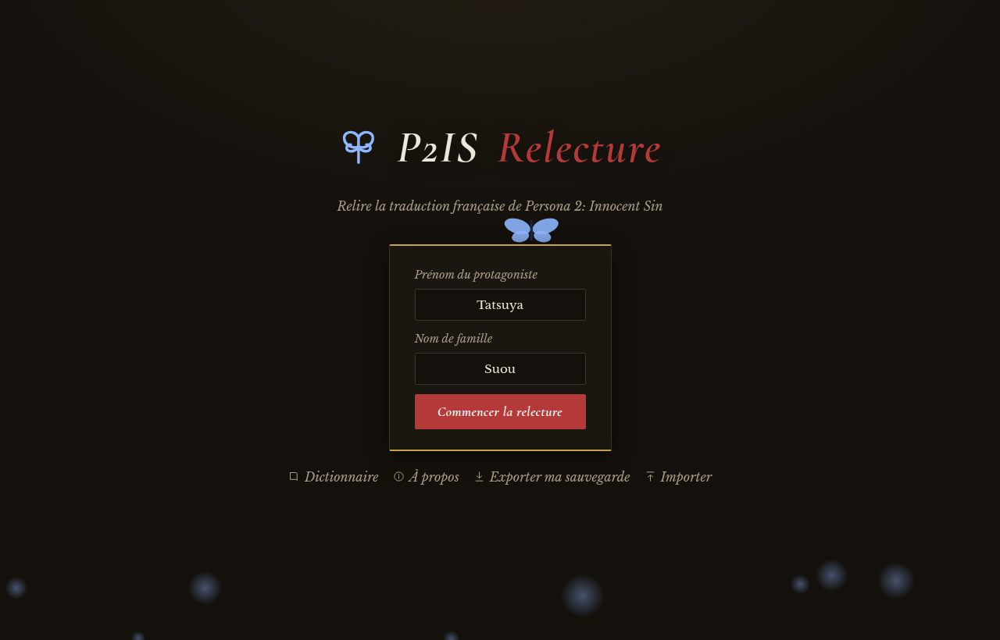
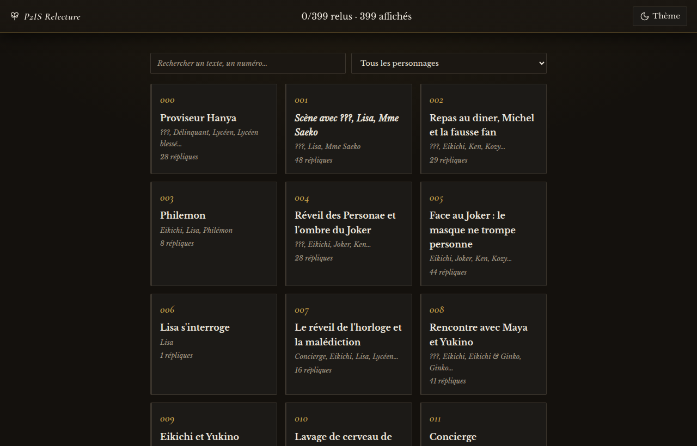
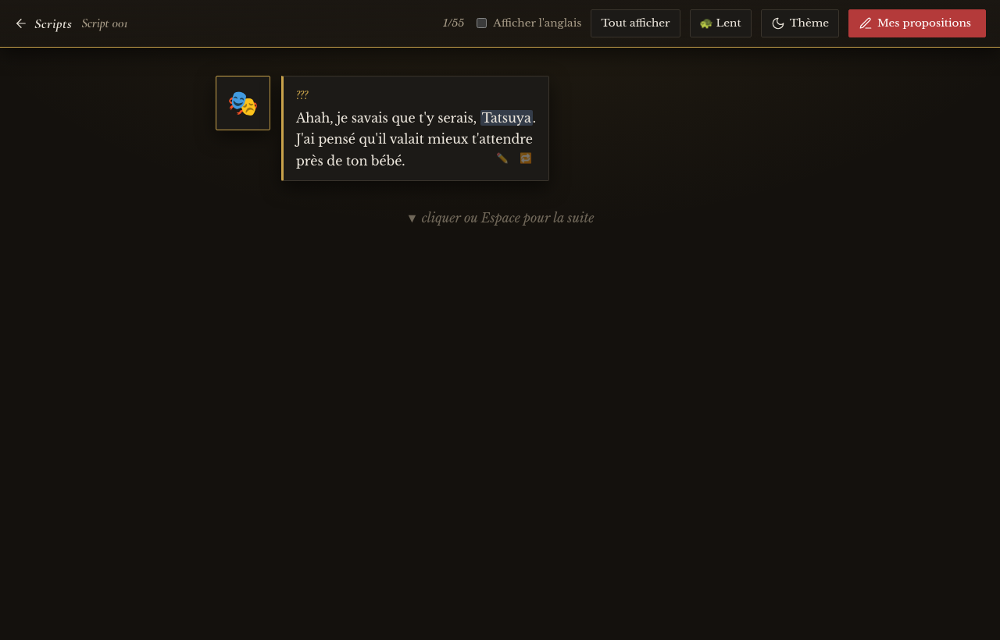

<div align="center">

# P2IS Relecture 🦋

**Outil web de relecture de la traduction française de *Persona 2: Innocent Sin* (PSP).**

On lit les scripts du jeu comme un visual novel — portraits, bulles, machine à
écrire, choix — on clique sur une bulle (ou une réponse de menu) pour proposer
une correction (avec contrôle automatique de la **limite de taille binaire**
du jeu), puis on envoie ses propositions groupées en une issue GitHub
pré-remplie.

`100 % statique` · `HTML/CSS/JS vanilla` · `zéro build` · `zéro dépendance runtime`

</div>

> Projet de fans, gratuit et non commercial. *Persona 2: Innocent Sin* © Atlus / SEGA.
> Projet de traduction : **[chenetulipe/P2-FR-IS-PSP](https://github.com/chenetulipe/P2-FR-IS-PSP)**

---

## ✨ Apparence

Direction visuelle **« Velvet Editorial »** : un *grimoire de relecture nocturne*,
sobre et littéraire, à grande respiration — pensé pour relire des heures.

- **Deux ambiances**, au choix via le bouton ☾/☀ : **Velvet Nuit** (encre sombre,
  par défaut) et **Velvet Jour** (parchemin clair). Le thème est mémorisé.
- **Typographie serif** auto-hébergée (`font/`) : *Cormorant Garamond* (titres,
  noms) + *Libre Baskerville* (corps), donc aucun appel réseau de polices.
- **Couleurs Persona 2 IS** : or « Innocent Sin », braise « Joker / rumeur »,
  bleu Philémon (le papillon animé de l'accueil).
- Icônes **SVG** (pas d'émoji de chrome), animations respectueuses de
  `prefers-reduced-motion`, responsive 375 → 1440 px.

## 📸 Aperçu

| Accueil — frontispice | Sommaire des scripts |
|:---:|:---:|
|  |  |



## 🎮 Fonctionnement

1. **Accueil** (`index.html`) : choisis le prénom/nom du protagoniste (défaut
   Tatsuya Suou) — ils remplacent les placeholders `[1113]`/`[1112]` pendant la
   lecture. À la validation, le portrait du héros se révèle avec le nom choisi.
2. **Sommaire** (`scripts.html`) : 399 scripts, recherche plein texte, filtre par
   personnage, progression ✦ par script.
3. **Lecture** (`lecture.html?s=NNN`) : fil de bulles progressif (clic/Espace),
   héros à droite, PNJ à gauche, comparaison FR/EN, termes du dictionnaire colorés.
4. **Proposition** : clic sur ✏️ (bulle ou réponse de menu) → éditeur à jetons
   (les codes du jeu sont des pastilles insécables ; pour un menu, la question
   reste gelée, seules les réponses sont éditables), jauge d'octets en direct,
   validation bloquée hors budget.
5. **Export** : le panier regroupe tes propositions → « Créer une issue GitHub »
   (lien pré-rempli vers `HamzaKarrouchi/P2-FR-IS-PSP/issues/new`, scindé en
   plusieurs issues si trop volumineux) — ou « Copier » en repli.

Tout est local (`localStorage`) : aucun compte, aucun serveur.

Guide détaillé pour les relecteurs : [CONTRIBUTING.md](CONTRIBUTING.md).

## 🛠️ Développement

Site **100 % statique**, zéro build. Servir le dossier suffit :

```bash
python3 -m http.server 8088       # http://localhost:8088
```

### Tests

```bash
npm install                                  # une fois (vitest, devDependency)
npm test                                      # tests JS (budget, etat, theme, grille, reveal, toast…)
python3 -m unittest discover tests_py -q      # tests Python (sync)
```

### Données (`data/`)

`data/` est **généré** par `sync.py` depuis le repo de traduction
(`../../Trad_Persona2/P2-FR-IS-PSP/`) puis **commité** (le site est autonome).
Quand la traduction évolue :

```bash
python3 sync.py                    # régénère data/
git -C . diff --stat data/         # relire le diff, puis commit
```

Exceptions éditables à la main (préservées par sync) : `data/labels.json`
(étiquettes des scripts) et `data/personnages.json` (portraits/emoji/couleurs).

### Vérification manuelle en navigateur (`e2e/`)

Scripts Playwright de bout en bout, **hors CI** et hors `npm test` (Playwright
n'est volontairement pas une dépendance du projet — voir `e2e/*.mjs` pour les
prérequis) :

```bash
NODE_PATH="$(npm root -g)" node e2e/editeur-choix.mjs [port] [numéro de script]
```

### Le calcul d'octets (`js/budget.js`)

Portage **exact** de `json_verify/utils.py:estimate_bytes` du repo de traduction —
la référence absolue qui garantit qu'un texte tient dans le slot binaire PSP.
Validé croisé sur 183 entrées réelles (`tests/fixtures-budget.json`).
**Ne jamais modifier l'algorithme d'un seul côté.**

## 📁 Structure

```text
index · scripts · lecture · dictionnaire · apropos   (pages HTML)
css/   commun · theme-nuit · theme-jour · typographie · accueil
js/    modules ES (accueil, grille, lecteur, editeur, panier, dico, budget,
       etat, theme, normalise, reveal, toast…)
font/  polices woff2 auto-hébergées
data/  généré par sync.py
```

## 🔀 Workflow git

- ⚠ Le dossier parent est un autre repo git : **toujours**
  `git -C /home/pchamza/Project/P2IS_Relecture/p2is-relecture <commande>`.
- `main` = stable. Le développement se fait sur des branches, mergées dans `main`
  quand c'est fonctionnel.
- 1 tâche = 1 commit (préfixes `feat:`/`fix:`/`chore:`/`docs:`), TDD : le commit
  inclut toujours ses tests.
- Spec & plan d'une refonte : `docs/superpowers/specs/` et `docs/superpowers/plans/`.
  L'avancement : `ROADMAP.md`.

## 🚀 Déploiement

Site **statique portable** : aucun build, chemins **relatifs** → déployable tel
quel dans n'importe quel hébergement statique, y compris un sous-dossier. Copier
l'arborescence (hors `node_modules/`, `tests/`, `tests_py/`, `docs/`) ; `data/` et
`font/` sont inclus et autonomes. L'hébergement est assuré sur un site de
**chenetulipe**.

## ❤️ Crédits

- **La communauté** — la traduction française est un effort collectif : de
  nombreux membres y ont contribué, relu et corrigé.
- **chenetulipe** — extraction des scripts, outillage et hébergement du projet de
  traduction et de ce site · [P2-FR-IS-PSP](https://github.com/chenetulipe/P2-FR-IS-PSP)
- **Garloulou** — premiers outils de vérification
- **Hamza** — traductions et développement de cet outil

Discussions et relectures sur **Discord** : <https://discord.gg/A8yUHfsNHF>
